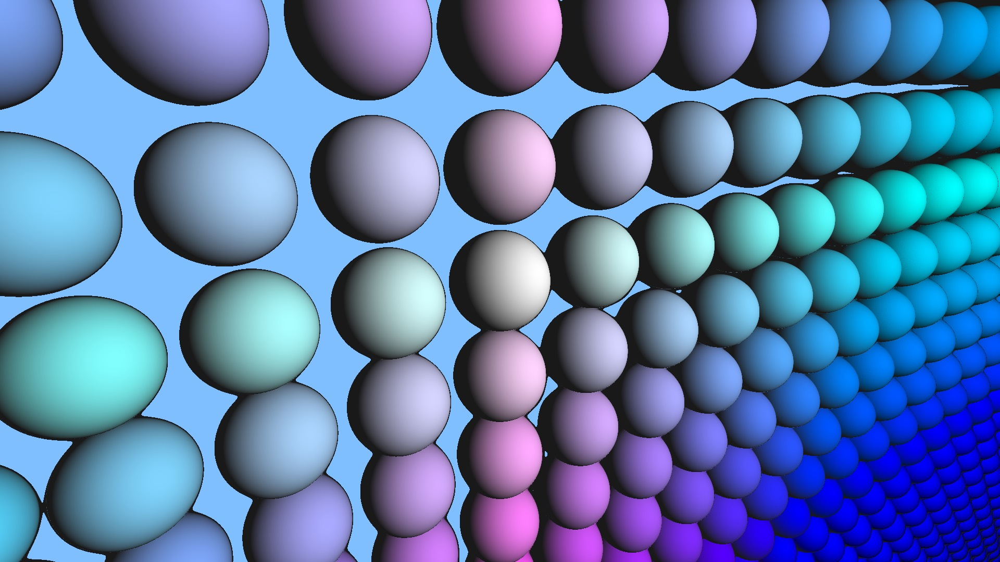

# SDF Kit

Tools for manipulating signed distance functions.

Main features include:

* [`Sdfs`](SdfKit/Sdf.cs) and [`SdfExprs`](SdfKit/SdfExpr.cs) libraries of combinable primitive shapes and modifiers.
* Multi-threaded batched sampling of the SDF for the perf perf perf.
* Color sampling! SDFs don't just return the distance to the closest object, but also that object's color.
* [`Voxels`](SdfKit/Voxels.cs) to store a regular-grid sampling of your SDF.
* [`MarchingCubes`](SdfKit/MarchingCubes.cs) implementation to export your SDF as a solid mesh from those `Voxels`.
* [`Raytracer`](SdfKit/Raytracer.cs) to create some sweet sweet 90s CG of your SDF in all its smooth glory. No voxels. No cubes. Just a pretty rendering of your analytic solid.

## Sample

The following code is used to define an SDF scene of inifinitely repeating spheres.
Each sphere's color and position are modified when repeated.

```csharp
var sdf = 
    SdfExprs
    .Sphere(0.5f, color: new Vector3(0.8f, 0.25f, 0.65f))
    .RepeatXY(
        1.25f, 1.0f,
        (d, i) => new Vector4(
            0.9f*Vector3.One - Vector3.Abs(i)/4f,
            d.W + i.X/20f))
    .ToSdf();
```



## Creating SDFs

There are four ways to provide SDF data:

1. **Provide a full batching implementation** by writing a function that processes multiple points at once. This is the most customizable solution but is also the most hassle.

    ```csharp
    Sdf sphere = (ps, ds) => {
        int n = ps.Length;
        var p = ps.Span;
        var d = ds.Span;
        for (var i = 0; i < n; ++i)
        {
            d[i] = p[i].Length() - 1.0f;
        }
    };
    ```

2. **Provide the SDF yourself** using `Sdfs.Solid`.

    ```csharp
    Sdf sphere = Sdfs.Solid(p => p.Length() - 1.0f);
    ```

3. **Use some of the built-in SDFs** that are in the static class `Sdfs`.

    ```csharp
    Sdf sphere = Sdfs.Sphere(1.0f);
    ```

4. **Use SDF Expressions to build the SDF** using the members of `SdfExprs`. This method makes it easy to build varied and efficient SDFs using a fluent syntax.

    ```csharp
    Sdf spheres =
        SdfExprs
        .Sphere(1.0)
        .RepeatXY(2.0)
        .ToSdf();
    ```

